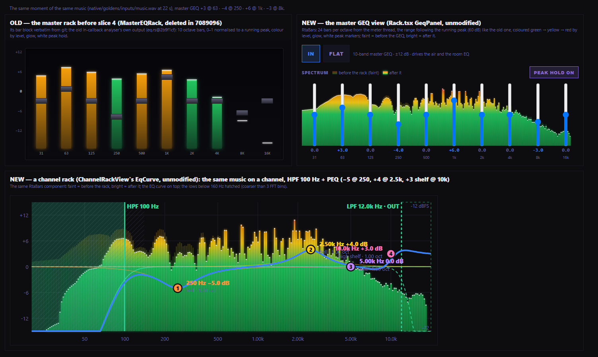

# Slice 8 — live RTA behind the channel EQ (proposal, 2026-09-26)

**Status:** GO given 2026-09-26. Engine and views built; on screen UNVERIFIED until Jeff's check. Dev only, branch `log-reader-flip`.

## Jeff's rulings (verbatim)

1. "4096-point FFT, 2048 hop."
2. "Third-octave, 31 bands."
3. "Peak hold off by default, with a toggle."
4. "Retire the old audio_get_spectrum and the levels-frame spectrum; the master analyser leaves the audio thread
   entirely."
5. "Both lanes pre-fader."

**Where the proposal below is superseded:**
- §2's "2048 points" is now 4096 with a 2048 hop.
- **The coarse limit:** §2 estimated "~100 Hz"; the build publishes **160 Hz**. A band is coarse when it holds fewer
  than **3** bins, the width a Hann main lobe needs (see the build).
- **Peak hold** is the view's (ruling 3). The engine publishes the attack/release display only.

**Jeff's ruling:** the EQ curve must sit over a live spectrum of the channel, so the operator sees the audio change
as the bands move. Pre-rack and post-rack.

**Governing:**
- `docs/dsp-meter-bus.md`: one meter reader per station; taps only read.
- `docs/dsp-loudness-meter.md`: the per-station meter thread, rings from the callback.
- `docs/dsp-rt-callback.md`: no allocation, no locks and no FFT on the audio thread.
- `docs/dsp-channel-rack-eq.md` §4: the EqCurve draws from the engine's own coefficients.

---

## What is there today (receipts)

**The only spectrum is the master's, and it runs on the audio thread.**
- `eq.rs` `EqChain::process_stereo` writes a mono ring every sample and runs a **2048-point FFT every 1024
  samples** (`update_spectrum`, `FFT_SIZE`/`FFT_INTERVAL`, eq.rs:131-132, :258-265).
- It publishes a smoothed **10-band** magnitude at the GEQ centres (0…1, normalised to a running peak, so
  **not** dBFS).
- **It runs in two instances.** `bus.eq` (air) and `bus.eq_room` (the room chain, audio.rs:4170) both feed their
  own ring and run their own FFT. Only `bus.eq`'s result is ever read (audio.rs:3974 → `bus.spectrum`), so **the
  room instance's FFT is computed for nothing, ~43 times a second.**

**Its one consumer** is the master GEQ editor.
- `Rack.tsx:396-405` polls `audio.getSpectrum` every 100 ms and draws ten translucent bars behind the faders
  (main.js:5408 → `audio_get_spectrum`).
- Nothing else in `src/`, `electron/` or `audiod/` reads `spectrum`. The levels frame carries it along unread.
  StudioPro's analyser is its own Web Audio node, not this.

**The channel racks have no spectrum at all.**
- `EqCurve.tsx` draws the curve from the engine's coefficients over an empty grid.

**The meter thread already exists per station** (`loudness.rs` `spawn_meter_thread`).
- It drains the callback's rings every 20 ms (`LOUD_TICK_MS`) and publishes every 100 ms (`LOUD_PUBLISH_MS`)
  through a triple buffer.
- Its rings are preallocated with the station state (`loud_channels`).

---

## 1 · The tap: one channel at a time, nothing when no rack view is open

**Selection.** A new `Params.rta: Option<RtaTarget>` holds `Channel(slot)`, `Master` or `None` (the default).
- It is set by a new command, `AudioCmd::SetRta`, through the one Params block like every operator value.
- **It is also held by a lease, not just by the UI.**
  - The rack view **subscribes** through the daemon (`rtaSubscribe(stationId, target)`) and renews every 2 s,
    the same TTL pattern as `metersSubscribe`.
  - When the last renewal is more than 5 s old, the daemon sends `SetRta(None)`.
  - So a closed window, a crashed renderer or a station switch **turns the tap off by itself**, not only when a
    component unmounts cleanly.

**The rings.** Two SPSC rings of mono `f32`, **pre** and **post**, 8192 frames each.
- They are created with `BusState`, like the loudness rings, and handed to the meter thread.
- Mono = (L+R)/2, matching the current analyser. A stereo-difference view is out of scope.

**In the callback (the only audio-thread work):**
- **For a channel,** inside the existing deck loop, only for `i == rta slot`:
  - **pre** = `feed × trim`, the same samples the pre-fader meter reads (pre-cut, pre-rack);
  - **post** = the rack's output lanes (`rack_l/rack_r`) when the rack runs, otherwise the pre samples;
  - both are **pre-fader**, like the rack view's IN/OUT meters. The spectrum shows what the EQ does, not where
    the fader is.
  - One `push_slice` per lane per buffer. A full ring drops samples and counts them (`rta_dropped`), never blocks.
- **For the master:**
  - **pre** = the programme mix before the GEQ;
  - **post** = after the GEQ, before the master fader;
  - the same two pushes.
- **When `rta` is `None` the cost is one branch per buffer.** No copy, no ring touch. That is the "idle cost is
  zero" requirement, stated as what it is.
- **Never on the audio thread:** no FFT, no windowing, no band maths.

## 2 · The analysis: on the meter thread

A new `native/src/rta.rs`, run by the existing per-station meter thread (the slice 3 thread) on its 20 ms tick.

**FFT:** 2048 points (46 ms at 44.1 kHz), Hann window, via rustfft with preallocated scratch.
- Hop 2048 = **21.5 updates/s**, at or above the requested ~20 Hz.
- The plan and buffers are made when the thread starts.

**Bands:** ISO **1/3-octave, 31 bands, 20 Hz–20 kHz** (recommended), or 1/6-octave (61 bands).
- Each band's level is the power sum of the FFT bins inside its edges. A bin that straddles an edge is split
  pro rata.
- It is expressed in **dBFS, calibrated so a full-scale sine reads 0 dB in its band**. The Hann window's power
  gain is corrected, so a −18 dBFS sine reads −18 dB.
- This replaces the old 0…1 "normalised to the running peak" bars, which could not be compared with anything.
- **The honest limit of 2048 points** (see Q1):
  - the bins are 21.5 Hz wide;
  - below ~100 Hz a 1/3-octave band is narrower than one bin, so the 20 / 25 / 31.5 / 40 / 50 / 63 Hz bands read
    the one or two bins that cover them;
  - they are drawn **hatched as "coarse"** below the frequency where a band holds fewer than two bins, so a
    reading is never shown as finer than it is;
  - at 1/6-octave the coarse region reaches ~200 Hz.

**Ballistics:**
- **attack instant** (a rising band takes the new value);
- **release 300 ms** (a falling band decays exponentially in dB with τ = 300 ms);
- **peak hold** optional, 2 s, off by default (Q3).

**Publication:** the thread writes an `RtaFrame { seq, target, fed, coarse_below_hz, pre: [f32; 31], post:
[f32; 31], dropped }` to its own triple buffer. It is published at the 21.5 Hz hop. The loudness frame's 100 ms
publish is not slowed or merged.

**On the wire:**
- `audio_get_rta(station)` returns it.
- The daemon's existing ~30 Hz **meter bus** frame gains an **`rta`** key. It is present only while a
  subscription is live, and `fed: false` when the target produced no audio.
- `smoke-meter-contract` gains RULE 6's check for the new key (the daemon forwards it).

## 3 · The drawing: behind the curve, on the same log axis

**In `EqCurve.tsx` (channel racks):**
- a canvas under the SVG curve, on the **same 20 Hz–20 kHz log axis** and a dB axis aligned to the curve's 0 dB
  line;
- **pre-rack:** a faint filled spectrum (`--rta-pre`, low alpha);
- **post-rack:** a brighter filled spectrum (`--rta-post`), drawn over pre;
- **the EQ curve stays on top,** unchanged. Its drag handles keep their hit areas; the spectrum takes no
  pointer events;
- bands below `coarse_below_hz` are drawn hatched; `fed: false` draws **NOT FED** rather than a flat floor;
- new tokens `--rta-pre` and `--rta-post` in all four themes.

**The master GEQ view (`Rack.tsx`):** the same component draws the same two layers behind the ten faders, on the
same log axis. **Both racks then read the same instrument.** The 100 ms `getSpectrum` poll is replaced by the
meter-bus `rta` key.

**Can the `eq.rs` analyser leave the callback entirely? Yes.**
- Its one consumer is the master GEQ view, which this slice moves to the RTA path.
- **Removed from `EqChain`:** the ring write per sample, the FFT, the window, the scratch, `spectrum()` and
  `peak`.
- **What goes with it:** two FFTs every 1024 samples (air and room), ~86 FFTs/s, plus a ring write per sample
  per instance.
- **The audio is untouched,** because the analyser never altered the samples. The goldens stay bit-exact.

**`audio_get_spectrum` / `levels.spectrum` (Q4):**
- **Recommended: retire them.** Keep `audio_get_spectrum` answering `[0…]` with a deprecation note for one release,
  so an older renderer against a newer engine doesn't throw.
- Or keep a 10-band summary derived from the RTA frame. But it would only be live while a rack view subscribes,
  which is a worse meter than none.

**The cost claim is UNVERIFIED until measured.** Two 2048-point FFTs every 1024 samples is estimated at tens of
µs per buffer. The timing rows (§4) measure the callback **before and after the removal** and report the real
number.

## 4 · Verification

**Through the real callback and the real analysis (Rust):**

| Claim | Test | Bar |
|---|---|---|
| **The right frequency moves** | A −18 dBFS log sweep 20 Hz→20 kHz on S1, RTA on S1, frames analysed by the real `rta.rs` | The loudest band tracks the sweep: each band's peak lands while the sweep is inside it. The peak reads **−18 ± 0.5 dB** in every band ≥ 2 bins wide. |
| **The rack's effect shows, by the filter's own curve** | Pink noise on S1, Filters HPF 100 Hz IN | For each band, post − pre = the HPF's own magnitude response at the band centre (the same coefficients `EqCurve` draws), **± 1 dB** in bands ≥ 2 bins wide. At and above 200 Hz: **0 ± 0.3 dB**. |
| **Master too** | GEQ band 1 kHz +6 dB IN, pink noise | post − pre at 1 kHz = +6 ± 0.5 dB; flat elsewhere by the GEQ's own curve |
| **Nothing when not asked** | `rta = None` for 3000 buffers | Zero samples pushed; `dropped` 0; the meter thread publishes `fed: false` |
| **One channel at a time** | S1 selected, S2 playing | S2's audio never reaches the rings |
| **Allocation trap** | Callback with the tap on, 12 channels playing, racks crossfading | **0** |
| **Timing unchanged** | The existing timing rows, plus "tap on" and "analyser removed" rows | Tap on: p99 within the existing gate. With `eq.rs`'s analyser gone, the median **drops**, and the new number is reported. |
| **Harness nulls (taps only)** | The 43 goldens with no tap; with the tap on S1; with the analyser removed | **bit-exact** in all three |
| **The lease** | Daemon smoke: subscribe, stop renewing | `SetRta(None)` sent within 5 s; a renewal after that re-arms it |

**The meter thread's work** (pure, unit-tested in `rta.rs`):
- the band edges and bin splits;
- the Hann power correction (a full-scale sine reads 0 dB);
- attack and 300 ms release;
- peak hold.

**UI:**
- vitest for the axis mapping: the spectrum and the curve share one frequency→x function, **the same function,
  not a copy**;
- a static smoke: both racks draw the RTA layer under the curve, the lease renews, `--rta-*` in 4 themes, the
  help exists.

**Not covered:** how it looks and feels while dragging a band. That is Jeff's screen check.

## 5 · Blast radius

| Area | Change |
|---|---|
| `native/src/rt.rs` | `Params.rta`; `RtaFrame`; the two rings in `BusHandles`/`BusState` |
| `native/src/audio.rs` | `AudioCmd::SetRta`; the tap in the deck loop (selected slot only) and at the master; tests and timing rows |
| `native/src/rta.rs` (new) | FFT, bands, ballistics, peak hold, calibration; unit tests |
| `native/src/loudness.rs` | the meter thread also drains the RTA rings and runs `rta.rs` on its tick |
| `native/src/eq.rs` | **remove the analyser** (ring, FFT, window, `spectrum()`); DSP untouched |
| `native/src/lib.rs` | `audio_set_rta`, `audio_get_rta`; `audio_get_spectrum` deprecated (Q4) |
| `audiod/ether-audiod.js` | `rtaSubscribe` with a TTL lease; `rta` on the meter-bus frame |
| `audiod/smoke-meter-contract.js` | the `rta` key |
| `electron/main.js`, `preload.js` | `audio:rta-subscribe`; the `getSpectrum` route retired or deprecated |
| `src/components/rack/EqCurve.tsx` | the RTA canvas under the curve (shared axis) |
| `src/components/rack/Rack.tsx` | the GEQ view reads the RTA; the 100 ms `getSpectrum` poll removed |
| `src/components/rack/ChannelRackView.tsx` | subscribes for its channel while open |
| `src/index.css` | `--rta-pre`, `--rta-post` × 4 themes |
| `docs/` | `help-channel-eq.md` and `help-processor-rack.md` (reading the spectrum); this doc's build sections |

---

## Decisions for Jeff

1. **FFT size:** 2048 as specified (46 ms, lows coarse below ~100 Hz and drawn hatched), or **4096** (93 ms,
   usable to ~50 Hz, still updated at ~21 Hz with a 2048 hop)? Recommended: **4096 with a 2048 hop**. The low end
   is where a mic's HPF and proximity effect live.
2. **Band resolution:** **1/3-octave, 31 bands** (recommended: readable, and every band is ≥ 2 bins from ~100 Hz
   at 4096), or 1/6-octave (61 bands, finer, coarse to ~200 Hz)?
3. **Peak hold:** off by default with a toggle in the rack view (recommended), or on?
4. **`audio_get_spectrum` / `levels.spectrum`:** retire (recommended; nothing else reads them), or keep a 10-band
   summary from the RTA?
5. **Pre-fader for both lanes** (recommended: the spectrum shows the EQ, not the fader), or post-fader post-rack?

## What this deliberately does NOT build

- More than one channel's spectrum at a time.
- An RTA on the board strips.
- A stereo or side-chain view.
- Analysis on the audio thread.

---

## Build — the engine (2026-09-26)

**Status:** built and proven through the real callback and the real analysis. Nothing draws it yet (UI commit).

### What was built

- **`native/src/rta.rs` (new).** Callback end:
  - `RtaTarget` (None / Channel / Master) rides the Params block (`Params.rta`, adopted by the callback like
    every value);
  - two 16 384-frame SPSC rings, pushed in lockstep: a buffer goes into both or neither, and a full ring is
    counted as `dropped`, never waited on;
  - `serve()` stores the target once, only when it changes;
  - `pushed` and `dropped` counters.
- **Meter-thread end, `RtaAnalyzer`:**
  - a 4096-point Hann FFT every 2048 samples (21.5 frames/s), everything preallocated;
  - 31 ISO third-octave bands: edges from the exact base-2 series, each band the overlap-weighted power sum of
    its bins;
  - calibrated so a full-scale sine reads 0 dB in its band;
  - instant attack; release exponential in power, τ = 300 ms (0.672 dB per hop);
  - **a target change clears the history and discards what is queued**, so a new channel never shows the old
    one's spectrum;
  - published through a triple buffer as `RtaFrame`.
- **`audio.rs`:**
  - `AudioCmd::SetRta`;
  - **the channel tap**, in the deck loop for the one selected slot only: pre = `feed × trim` (what the pre-fader
    meter reads), post = the rack's output, or pre when the rack runs nothing;
  - **the master tap**: pre = the mix before the GEQ, post = after it;
  - both lanes pre-fader (ruling 5);
  - the meter thread (`spawn_meter_thread`) now drains the RTA each 20 ms tick.
- **`lib.rs`:** `audio_set_rta(station, "" | "master" | fader)`, `audio_get_rta(station)` →
  `{ v, seq, target, fed, centres, coarseBelowHz, pre[31], post[31], pushed, dropped }`.
- **Retired (ruling 4):**
  - `audio_get_spectrum`, the levels-frame `spectrum`, `MeterFrame.spectrum` and `BusState.spectrum` are gone;
  - **the `eq.rs` analyser has left the audio thread entirely.** `EqChain` is now only its ten filters: no ring, no
    window, no FFT, no `spectrum()`;
  - main's `audio:getSpectrum` and the daemon's `getSpectrum` answer an inert `[]` until the UI commit removes the
    view that polls them.

### Receipts (dev app stopped)

```
[rta-sweep] every band ≥ 160 Hz: peak −18 -0.03 dB at worst (bar ±0.5), and it peaked while the sweep was inside it: all 31 − coarse
            (each band's peak: 160:-18.03 200:-18.00 … 20000:-18.00; coarse: 20:-23.49 25:-23.03 31.5:-21.49 40:-21.45 50:-20.70 63:-19.35 80:-18.81 100:-18.45 125:-18.11)
[rta-hpf]   pink noise on S1, Filters HPF 100 Hz IN, 40 s — bands ≥ 160 Hz: worst error -0.02 dB against the filter's own curve (bar ±1); ≥ 200 Hz within -0.02 dB of 0
            (coarse, measured/expected: 20:-48.0/-55.9 25:-44.3/-47.8 31.5:-36.9/-39.8 40:-29.5/-31.8 50:-22.4/-23.8 63:-15.6/-15.9 80:-8.1/-8.5 100:-3.2/-3.1 125:-0.8/-0.7)
[rta-geq]   pink noise on A, master GEQ 1 kHz +6 dB IN, RTA on the MASTER: the 1 kHz band reads +5.89 dB (the GEQ's own curve over that band: +5.89; its peak at 1 kHz: +6.00)
[rta-idle]  12 faders playing, RTA unsubscribed, 3000 buffers: 0 frames pushed, 0 dropped, 0 allocations · S1 chosen (silent) with S2 playing pink noise: loudest band -120.0 dB (the floor)
[rta-trap]  12 faders playing, all 12 racks crossfading every 20 buffers, the RTA switching between S1 and the master: 0 allocations over 600 buffers
[rta-cal]   1 kHz at 0 dBFS reads +0.000 · at −18 reads −18.000 · 315 Hz and 8 kHz at −18 read −18.000
[rta-ballistics] release 0.672 dB per 46 ms hop (14.5 dB/s)
[rta-coarse] bins 10.77 Hz; bands below 160 Hz are narrower than 3 bins → COARSE
```

**Timing, before and after removing the in-callback FFTs.** Same rows on both trees: the pre-slice tree measured
from a worktree at `2b9f1cf`. Three runs each:

| Row | Before (analyser in the callback) | After |
|---|---|---|
| The master EQ stage alone, 480 frames, flat GEQ | median 0.0011–0.0031 ms · **p99 0.0076–0.0245 ms** (the FFT blocks) | median 0.0004–0.0005 · **p99 0.0009–0.0011 ms** |
| Callback, A/B/C playing | median 0.0292–0.0330 · p99 0.0401–0.0546 | median 0.0266–0.0284 · p99 0.0411–0.0449 |
| Callback, A/B/C + aux D (room chain + its EQ) | median 0.0376–0.0415 · p99 0.0563–0.0708 | median 0.0322–0.0327 · p99 0.0596–0.0630 |
| Callback, A/B/C + S1, no tap | median 0.0361–0.0420 · p99 0.0568–0.1058 | median 0.0319–0.0323 · p99 0.0491–0.0567 |
| Callback, A/B/C + S1, **RTA tap ON S1** | — | median 0.0369–0.0381 · p99 0.0465–0.0697 |

**What that says:**
- With the analyser gone, the callback median drops **~0.003 ms** (A/B/C) and **~0.007 ms** (with the room chain,
  which ran a second, unread FFT).
- The EQ stage's p99, where the FFT blocks landed, drops about tenfold.
- **The tap itself costs ~0.005 ms** at the median while it is on, and nothing while it is off (`[rta-idle]`).

**Goldens:**
- `[null]` 43/43 bit-exact (`taps not bit-exact: []`), `[rack-null]` 43/43, `[ch-out-null]` 43/43;
- `[trap] 43 renders, 0 allocations`;
- NAPI: `[napi] 43/43 renders bit-exact to the manifest` on the fresh build (sha256 `29ad0b97…`).

**Suite:**
- 108 lib tests pass; bench 7 and doctests 2 pass (run on their own; see below);
- the export check: `audioSetRta` and `audioGetRta` are functions, `audioGetSpectrum` is undefined, and a bad
  target is refused with its reason.

**JS gates:**
- tsc 0; vitest 494/494;
- show-presets 52, rack-eq 30, mic-input 25, pfl 22, dynamics 10, meter contract 30;
- undefined-calls, preload-bridge, ipc-contract, one-switch, audio-isolation PASS;
- leak guard OK; build OK.

### One gate failed, and it fails on the tree before this slice too

`channel_rack_cost_one_and_twelve_channels` (Jeff's slice 5/6 gate: rack CPU max ≤ 0.5 ms, p99 ≤ 1 ms) failed in
the full suite run on a mic row: rack CPU max 0.550 ms.
- **Alone on this tree:** 2 of 3 runs pass; one fails on a different row (5 mics, 0.534 ms).
- **Alone on the pre-slice-8 tree** (worktree at `2b9f1cf`, 4 runs): **2 of 4 fail the same way**, with worse
  numbers (0.829 ms, 0.939 ms, and a p99 of 1.126 ms).
- **This slice doesn't touch the rack DSP** the row times: the tap sits outside `chdsp` and is off in that test.

It is a worst-case CPU figure that is noisy on this box today, not a slice 8 regression. **Reported, not
loosened.** Because `test:rust` stops at the first failure, the bench and doctests were run on their own.

---

## Build — the views (UI) (2026-09-26)

**Status:** built. **What it looks like on screen is UNVERIFIED until Jeff's check.** That includes the two
spectrums moving under the curve while a band is dragged, and the master GEQ's spectrum under its faders.

### The lease and the wire

- **`audiod/rta-lease.js` (new, pure):**
  - one lease per station, keyed by what the view asks for (a fader, `"master"`, or `""` to stop);
  - the engine's target is sent only when it **changes**;
  - `expire()` returns the stations whose last renewal is more than **5 s** old.
- **`ether-audiod.js`:**
  - `rtaSubscribe` holds the lease;
  - a 47 ms timer clears lapsed leases (`audioSetRta(sid, "")`, logged);
  - it emits an **`rta` event per new analysis frame**, by station UUID, only for stations with a lease, and never
    the same frame twice.
  - **Changed from the proposal:** the proposal put `rta` on the ~30 Hz meter-bus frame. It is its own event
    instead, so a view that isn't metering still gets it, and the meter frame's contract (`smoke-meter-contract`)
    is untouched.
- **main:** `audio:rta-subscribe` → the daemon, with the station UUID. `rta` events are forwarded as
  **`audio:rta`**, carrying the UUID and never the integer. Without the audio service the view says the spectrum
  needs it.
- **preload:** `audio.rtaSubscribe / onRta / offRta`.
- **Retired end to end (ruling 4):** the `audio:getSpectrum` route, the daemon's `getSpectrum` and the preload's
  `getSpectrum` are gone.

### Drawing

- **`src/components/rack/rta.ts` (new):**
  - the engine's band edges (the exact base-2 series);
  - `rtaPath`: a step outline across each band's edges, closed to the floor, **on the caller's own x**;
  - `dbfsY`: 0 dBFS at the top, −90 at the bottom;
  - `coarseSpan` for the hatch; `holdStep` for PEAK HOLD (2 s);
  - `geqX`: the master GEQ's log axis, which puts each of its ten faders over its own octave.
- **`useRta(target)`:**
  - subscribes while mounted with a target, renews every **2 s**, and sends `""` on unmount;
  - takes only this station's frames for this target;
  - **PEAK HOLD** is off unless the viewer turns it on (remembered per viewer, ruling 3).
- **`EqCurve`:**
  - under everything touchable: **pre (faint, `--rta-pre`)** and **post (brighter, `--rta-post`)**, on the
    curve's own `x`;
  - held peaks as a dashed line (`--rta-post-line`);
  - the coarse bands (below 160 Hz) hatched;
  - **NOT FED** when nothing plays;
  - the dBFS scale labelled on the right;
  - `pointerEvents="none"`. **The curve and its handles stay on top.**
- **`ChannelRackView`:**
  - it listens **only while the EQ curve is on screen** (Filters or PEQ shown, not Gate/Comp);
  - an **`RtaBar`** above the curve: the legend, its state (waiting / nothing playing / unavailable) and
    **PEAK HOLD ON/OFF**.
  - **Named, not built:** a rack with no Filters or PEQ has no curve, so it shows no spectrum. Adding Filters
    shows both.
- **The master GEQ view (`Rack.tsx`):** the same `RtaBar`, and the same two layers behind the ten faders on
  `geqX`. The 100 ms `getSpectrum` poll and its ten 0…1 bars are gone.
- **Tokens** `--rta-pre`, `--rta-post` and `--rta-post-line` in all four themes.

### Help

- **`help-channel-eq.md`:** a new **Reading the spectrum** section (faint = before the rack, bright = after it,
  pre-fader, 0 to −90 dBFS, the hatched lows, NOT FED, PEAK HOLD, runs only while shown).
- **`help-processor-rack.md`:** the GEQ's spectrum (before/after the GEQ, each fader over its octave).

### Receipts

- **vitest `rta.test.ts`, 6/6:**
  - band edges are the engine's, and adjacent bands share an edge;
  - the dBFS mapping;
  - the step outline lands a band's level across its own edges on the caller's x;
  - peak hold holds 2 s, then follows;
  - the coarse hatch;
  - the GEQ axis puts each fader over its octave.
  - **Total: 500/500.**
- **`test:rta`, 22/22:**
  - **the lease:** a first subscription sets the target, a renewal sends nothing, a new target replaces it,
    renewed within 5 s it stays live, **more than 5 s without a renewal lapses it**, a returning view re-arms it,
    `""` stops it at once;
  - **the wiring:** the daemon clears the target on a lapse; frames go out by UUID; the old spectrum is retired end
    to end; main routes and forwards;
  - **the view:** it renews every 2 s and says `""` on unmount; the channel spectrum is on the curve's own `x` and
    under the curve; NOT FED and the hatch; it listens only while the curve shows; PEAK HOLD is off by default;
    the master reads the RTA;
  - tokens in 4 themes; `eq.rs` has no FFT; the help exists.
- **Gates:**
  - tsc 0;
  - show-presets 52, rack-eq 30, mic-input 25, pfl 22, dynamics 10, meter contract 30;
  - undefined-calls, preload-bridge, ipc-contract, one-switch, audio-isolation PASS;
  - cmd-routing 7, enginestate-wire 15;
  - leak guard OK; `npm run build` OK.

---

## Regression: the master GEQ's spectrum (2026-09-26)

**Jeff's report (verbatim):** "the master GEQ view's spectrum is now 31 flat one-colour bars — the old analyser drew a
smooth, detailed, colour-coded wave; this is worse and the proposal said "reuse"."

**Jeff's ruling (verbatim), with the old master rack on screen:** "bring back its level-coloured bars with glow and
peak-hold markers — green/yellow/red by level, per band — at the new fine resolution (the ~240 smoothed points from
the meter thread, drawn as fine bars or a filled wave with the same level colouring). Never one flat colour.
Pre-rack faint, post-rack full colour, curve on top. Same component for master and channel. Screenshot old vs new
in the doc."

**Status:** fixed as ruled. What it looks like live is UNVERIFIED until Jeff's check.

### What the old view was (from git)

- **The rack's GEQ editor at 2b9f1cf** drew **ten translucent bars in one colour** (`--slot-eq` at 0.18
  opacity) behind its faders.
- **Before slice 4, the master rack was `MasterEQRack.tsx`** (deleted in 7089096). **That is the view in Jeff's
  image:**
  - ten bars, coloured by level (cyan → green → amber → red on a 0–1 scale normalised to a running peak);
  - a gradient and a glow on each bar;
  - a white peak-hold line.
- **The analyser behind both** was `eq.rs`'s: a 2048-point FFT, octave bands, normalised to a running peak.
- **No view in the history drew a continuous wave** from the engine's spectrum. StudioPro's EQ and the mixer strip
  use their own Web Audio analysers, and they draw bars.

**What slice 8 had broken:**
- it drew the 31 bands in one flat colour;
- it measured in absolute dBFS, so music never climbed the colour scale;
- it dropped the glow;
- it hid the peak markers behind a toggle that defaulted off.

### What was built

- **The engine publishes a fine wave** besides the 31 bands (`native/src/rta.rs`):
  - 241 points, 20 Hz × 1000^(k/240), about 24 per octave;
  - each is the power sum of the FFT bins in a window 1/24 octave wide, **never narrower than 3 bins**;
  - so a tone reads its level at the point nearest it at every frequency. Below ~1.1 kHz that window is a constant
    32 Hz: smoother there than 1/24 octave, with position resolved to one 10.8 Hz bin;
  - the same calibration and ballistics as the bands;
  - on the wire as `finePre` / `finePost`. **The bands stay** as the numeric readout.
- **`RtaBars` (new), the one component both views draw:**
  - one bar per fine point, on the caller's own x (the channel curve's, or the GEQ's octave axis);
  - **coloured by height through the old rack's levels:** green at the base, then yellow, amber and red. Only the
    loudest bars reach red;
  - post-rack **glowing** (the old box-shadow); pre-rack **faint**; **white peak-hold markers** per point.
- **The range follows the running peak** like the old analyser's normaliser (`autoTop`):
  - the top sits about 6 dB above the loudest recent point, released at 2 dB/s, in 3 dB steps so it doesn't
    shimmer;
  - the view covers the 60 dB below it;
  - **the label on the right says what the top really is in dBFS.** The old 0–1 scale never said.
- **The channel view** (`EqCurve`) and **the master GEQ view** (`GeqPanel`, split out of `GeqEditor` so the
  harness can render it) both draw `RtaBars`, with the curve and the faders on top.
- **PEAK HOLD is now ON by default** (toggle kept). ⚠ **This supersedes ruling 3's "off by default":** the old rack
  always showed its markers and the new ruling brings them back. Say if the default should go back to off.
- **Retired:** the unused 31-band step outline (`rtaPath`) and the three `--rta-*` colour tokens.

### Old vs new: the same moment of the same music



`docs/dsp-channel-rta-old-vs-new.png`. **How it was made:**
- **Data:** `native/goldens/inputs/music.wav` at 22 s, through the **real callback**, with the master GEQ at
  +3 @ 63 · −4 @ 250 · +6 @ 1k · −3 @ 8k. Recorded by the engine test `rta_screens_fixture`, which runs only when
  `ETHER_WRITE_RTA_SCREENS` is set.
- **OLD:** `MasterEQRack`'s bar block **verbatim from git 7089096~1**, fed the old analyser's **own output**. The
  analyser is `eq.rs@2b9f1cf`'s `update_spectrum`, its maths copied verbatim into the test, run on the same post-GEQ
  samples. The peak hold is `MasterEQRack`'s.
- **NEW:** the **real components, unmodified**. `GeqPanel` (master) and `EqCurve` (a channel: the same music on S1
  through HPF 100 Hz + a PEQ) draw the meter thread's frames for the same samples.
- **Rendered** by `scripts/rta-screens/capture.js` (esbuild bundle of `entry.tsx`, the app's own CSS, an offscreen
  Electron capture). **Re-run:** the two commands in its header.
- **What it is not:** a screenshot of the running app. That is Jeff's screen check.

**Jeff decides which is better.**

### Receipts

- **`[rta-fine]`** a −18 dBFS tone peaks at the fine point nearest it, at −18 −0.29 dB at worst:

  | Tone | Peak point | Level |
  |---|---|---|
  | 60 Hz | 63.2 Hz (+3.2, within one 10.8 Hz bin) | −18.07 |
  | 125 Hz | 126.2 Hz | −18.08 |
  | 440 Hz | 435.0 Hz | −18.29 |
  | 1 kHz | 1002.4 Hz | −18.11 |
  | 3150 Hz | 3169.8 Hz | −18.00 |
  | 9 kHz | 8933.7 Hz | −18.00 |
  | 16 kHz | 15886.6 Hz | −18.00 |

  **Fixed in the test:** it first demanded 1/24 octave everywhere. Below ~1 kHz that is finer than one FFT bin, so
  the bar is now max(1/24 octave, one bin).
- **The channel frame in the screenshot** (post − pre, the HPF's cut): 30 Hz −30.4 dB, 50 Hz −15.9, 71 Hz −9.8,
  100 Hz −4.4; 1 kHz +0.2; 2.5 kHz +3.9 (the +4 PEQ band).
- **Unchanged and still passing:** the sweep (every band ≥ 160 Hz at −18, worst −0.03 dB), HPF post−pre (0.02 dB),
  GEQ +6 → +5.89, nothing copied when unsubscribed, trap 0.
- **Suite:** `npm run test:rust` 111 lib + 7 bench + 2 doctests pass, **including the rack-CPU gate this run**.
- **Goldens:** 43/43 `[null]`, `[rack-null]`, `[ch-out-null]`; trap 43 renders 0; NAPI 43/43 on the fresh build
  (sha256 `ba72bf47…`).
- **vitest 507/507**, including `rta.test.ts` 8/8:
  - the fine points are the engine's, bars edge to edge;
  - the level colours run green to red, four or more colours, never one;
  - `autoTop`: instant up, 2 dB/s down, 3 dB steps, never above 0 dBFS;
  - peak hold per point.
- **`test:rta` 28/28:**
  - the channel spectrum is `RtaBars` on the curve's own x;
  - it is filled with the level gradient, never a flat `--rta-*` colour;
  - post glows; white peak markers; pre faint and post full;
  - the running-peak range, labelled in dBFS;
  - the master uses the same component;
  - PEAK HOLD on by default;
  - the views draw the fine wave.
- **Gates:** tsc 0; show-presets 52; rack-eq 30, mic-input 25, pfl 22, dynamics 10, meter contract 30;
  undefined-calls, preload-bridge, ipc-contract, one-switch, audio-isolation PASS; leak guard OK; build OK.
